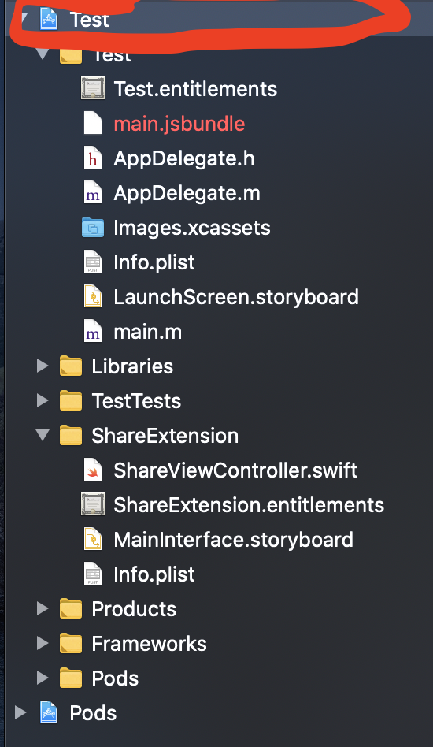
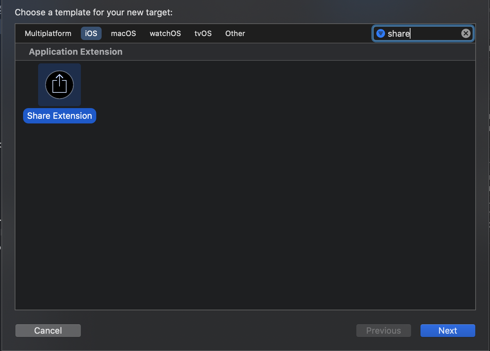
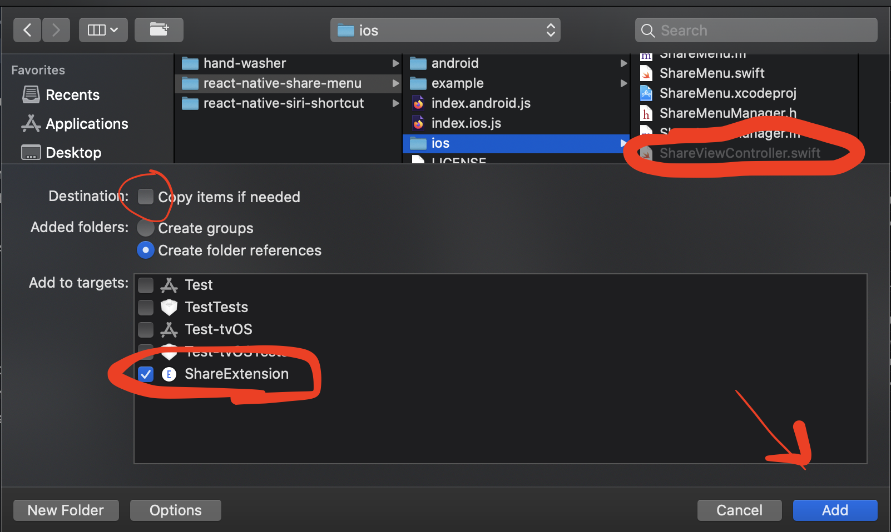
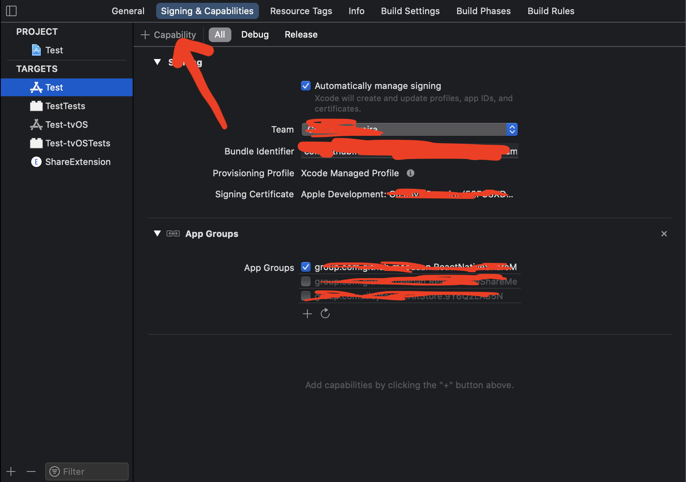

# react-native-share-menu

Adds the application to the share menu of the device, so it can be launched from other apps and receive data from them (current text or images).

## Installation

* Install the module

```bash
npm i --save react-native-share-menu
```

### Automatic Linking (React Native 0.60+)

At the command line, in the ios directory:

```bash
pod install
```

### Manual Linking (React Native 0.36+)

At the command line, in the project directory:

```bash
react-native link
```

## Usage in Android

### Manual Installation

* In `android/settings.gradle`

```gradle
...
include ':react-native-share-menu', ':app'
project(':react-native-share-menu').projectDir = new File(rootProject.projectDir, '../node_modules/react-native-share-menu/android')
```

* In `android/app/build.gradle`

```gradle
...
dependencies {
    ...
    compile project(':react-native-share-menu')
}
```

* In `android/app/src/main/AndroidManifest.xml` in the `<activity>` tag:

```xml
<activity
  ...
  android:documentLaunchMode="never">
  ...
  <intent-filter>
    <action android:name="android.intent.action.SEND" />
    <category android:name="android.intent.category.DEFAULT" />
    <data android:mimeType="text/plain" />
    <data android:mimeType="image/*" />
  </intent-filter>
</activity>
```

* Register module (in MainApplication.java)

```java
import com.meedan.ShareMenuPackage;  // <--- import

public class MainApplication extends Application implements ReactApplication {
  ......
  @Override
  protected List<ReactPackage> getPackages() {
    return Arrays.<ReactPackage>asList(
      new MainReactPackage(),
      new ShareMenuPackage()  // <------ add here
    );
  }
  ......

}
```

## Usage in iOS

Create a Share Extension by going to your project settings



Then creating a new target


And choosing Share Extension



Name your extension and make sure you've selected Swift as the language to use

Select your new target, go to `Build Settings`, search for `iOS Deployment Target` and make sure it matches your app's target (iOS 10.0 in RN 0.63)

When your extension has been created, delete the `ShareViewController.swift` file generated by Xcode in the extension folder, right click on the folder, and choose `Add Files to "ProjectName"`

On the pop-up, select `node_modules/react-native-share-menu/ios/ShareViewController.swift`. Make sure `Copy items if needed` is not selected and that the selected target is your newly created Share Extension



Create an App Group to be able to share data between your extension and your app. To do so, go to your app target's settings, go to `Signing & Capabilities`, press `+ Capability` and select `App Groups`



At the bottom of the window on Xcode you should see an `App Groups` section. Press the `+` button and add a group named `group.YOUR_APP_BUNDLE_ID`.

Repeat this process for the Share Extension target, with the exact same group name.

Add the following to your app's `Info.plist` (if you already had other URL Schemes, make sure the one you're adding now is the FIRST one):

```OpenStep Property List:
<key>CFBundleURLTypes</key>
<array>
    <dict>
        <key>CFBundleTypeRole</key>
        <string>Editor</string>
        <key>CFBundleURLSchemes</key>
        <array>
            <string>A_URL_SCHEME_UNIQUE_TO_YOUR_APP</string>
        </array>
    </dict>
</array>
```

Add the following to your Share Extension's `Info.plist`:

```OpenStep Property List:
<key>HostAppBundleIdentifier</key>
<string>YOUR_APP_TARGET_BUNDLE_ID</string>
<key>HostAppURLScheme</key>
<string>YOUR_APP_URL_SCHEME_DEFINED_ABOVE</string>
<key>NSExtension</key>
<dict>
    <key>NSExtensionAttributes</key>
    <dict>
        <key>NSExtensionActivationRule</key>
        <dict>
            <!-- For a full list of available options, visit https://developer.apple.com/library/archive/documentation/General/Reference/InfoPlistKeyReference/Articles/AppExtensionKeys.html#//apple_ref/doc/uid/TP40014212-SW10 -->
            <key>NSExtensionActivationSupportsImageWithMaxCount</key>
            <integer>1</integer>
            <key>NSExtensionActivationSupportsText</key>
            <true/>
            <key>NSExtensionActivationSupportsWebURLWithMaxCount</key>
            <integer>1</integer>
        </dict>
    </dict>
    <key>NSExtensionMainStoryboard</key>
    <string>MainInterface</string>
    <key>NSExtensionPointIdentifier</key>
    <string>com.apple.share-services</string>
</dict>
```

Finally, in your `AppDelegate.m` add the following:

```Objective-c
...
#import <RNShareMenu/ShareMenuManager.h>

...

@implementation AppDelegate
    ...
    
    - (BOOL)application:(UIApplication *)app
            openURL:(NSURL *)url
            options:(NSDictionary<UIApplicationOpenURLOptionsKey,id> *)options
    {
      return [ShareMenuManager application:app openURL:url options:options];
    }
@end
```

## Example

```javascript
import React, {
  AppRegistry,
  Component,
  Text,
  View
} from 'react-native';
import ShareMenu from 'react-native-share-menu';

class Test extends Component {
  constructor(props) {
    super(props); 
    this.state = {
      sharedText: null,
      sharedImage: null
    };
  }

  componentWillMount() {
    var that = this;
    ShareMenu.getSharedText((text :string) => {
      if (text && text.length) {
        if (text.startsWith('content://media/') || text.startsWith('file://')) {
          that.setState({ sharedImage: text });
        } else {
          that.setState({ sharedText: text });
        }
      }
    })
  }

  render() {
    var text = this.state.sharedText;
    return (
      <View>
        <Text>Shared text: {text}</Text>
      </View>
    );
  }
}

AppRegistry.registerComponent('Test', () => Test);
```

Or check the "example" directory for an example application.

## How it looks

 

## Releasing a new version

`$ npm version <minor|major|patch> && npm publish`

## Credits

Sponsored and developed by [Meedan](http://meedan.com).

iOS version maintained by [Gustavo Parreira](https://github.com/Gustash).
